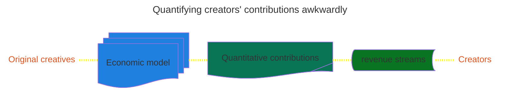

### 🔰[Quantifying creators’ contributions awkwardly](https://viadean.notion.site/Quantifying-creators-contributions-awkwardly-1551ae7b9a3280d78062fe5d3d185c03?pvs=4)

```mermaid
---
title: Quantifying creators' contributions awkwardly
---
%%{init: {"flowchart": {"defaultRenderer": "elk"}} }%%
graph LR

A@{shape: text, label: "Original creatives"}
B@{shape: tag-doc, label: "Quantitative contributions"}
C@{shape: docs, label: "Economic model"}
A:::c4-...-C:::c3-...-B
D@{shape: bow-rect, label: "revenue streams"}
E@{shape: text, label: "Creators"}
B:::c2-...-D:::c1-...-E:::c4

classDef c1 fill:#097523
classDef c2 fill:#097555
classDef c3 fill:#1f80e0
classDef c4 color:#e0531f

linkStyle 0,1,2,3 stroke:#ff3,stroke-width:4px,color:red;
```
