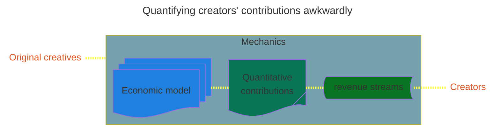

### 🔰[Quantifying creators’ contributions awkwardly](https://viadean.notion.site/Quantifying-creators-contributions-awkwardly-1551ae7b9a3280d78062fe5d3d185c03?pvs=4)
The issue of creators not getting paid for their data being used in AI training is a significant topic in the ethical and legal discussions surrounding artificial intelligence and machine learning. This concern arises because many AI systems are trained on vast datasets that may include copyrighted material, user-generated content, and other intellectual property, often without explicit consent or compensation to the creators.

